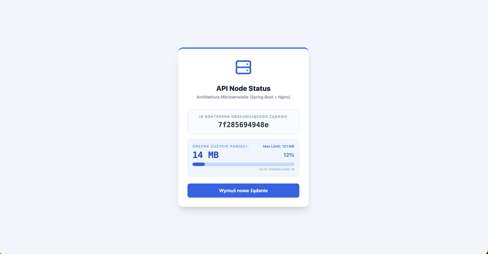
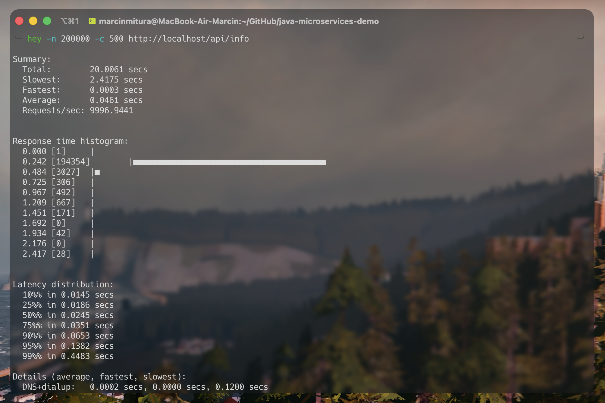

# 🐳 Scalable Java Microservices Demo


Głównym celem repozytorium jest praktyczna demonstracja ewolucji aplikacji z architektury monolitycznej do nowoczesnych, konteneryzowanych mikroserwisów. Projekt udowadnia działanie load balancingu, dynamicznego skalowania oraz kontroli zasobów (limitów pamięci) maszyny wirtualnej Javy (JVM) w środowisku Docker.

## 🏗️ Architektura systemu

System opiera się na trzech odseparowanych warstwach (Decoupled Services):

1. **Frontend (Live Tracker):** Lekki, responsywny interfejs napisany w HTML/JS + Tailwind CSS. Dynamicznie odpytuje API i wizualizuje obciążenie pamięci JVM oraz rotację kontenerów w czasie rzeczywistym.
2. **Load Balancer (Nginx):** Reverse proxy działające na porcie 80, rozdzielające ruch przychodzący na dostępne instancje backendowe za pomocą algorytmu Round-Robin.
3. **Backend API (Spring Boot):** Skalowalna usługa wystawiająca endpoint REST (`/api/info`), który zwraca aktualny identyfikator kontenera oraz stan pamięci sterty (Heap Memory) w formacie JSON.

## 📂 Struktura projektu

```sh
~/java-microservices-demo/
├── docker-compose.yml                # Konfiguracja orkiestracji usług i limitów cgroups (RAM)
├── Dockerfile                        # Przepis na budowę obrazu aplikacji Spring Boot
├── nginx.conf                        # Konfiguracja Load Balancera (Reverse Proxy)
├── pom.xml                           # Zależności Maven dla Javy
├── README.md
├── screenshots
│   └── demoPage.png                  # Zrzut ekranu z działającej aplikacji
│   └── heyTest.png                   # Zrzut ekranu z wynikami testu obciążeniowego
└── src/
    └── main/
        ├── java/com/example/demo/
        │   └── DemoApplication.java  # Główna logika API (Endpoint JSON)
        └── resources/
            └── static/               # Odseparowana warstwa prezentacji (Frontend)
                ├── index.html        # Struktura i widok panelu Tailwind
                └── app.js            # Logika asynchroniczna i monitorowanie obciążenia JVM.
```

## 🛠️ Wymagania wstępne

Aby uruchomić projekt na swoim komputerze, potrzebujesz:

* Zainstalowanego środowiska **Docker** (oraz Docker Compose).
* Narzędzia **`hey`** do przeprowadzenia testów obciążeniowych (opcjonalnie).
* *Instalacja macOS:* `brew install hey`
* *Instalacja Linux:* `sudo apt-get install hey`

## 💻 Jak uruchomić?

1. Sklonuj repozytorium:

```bash
git clone https://github.com/mavethee/java-microservices-demo.git
cd java-microservices-demo
```

2. Zbuduj obrazy i uruchom środowisko w tle:

```bash
docker compose up --build -d
```

3. Otwórz przeglądarkę i przejdź pod adres:

**[http://localhost](http://localhost)**



4. Aby zatrzymać i wyczyścić środowisko:

```bash
docker compose down
```

## 🎯 Przykłady użycia

1. **Weryfikacja działania (Round-Robin):** Po wejściu na `http://localhost:80`, Nginx automatycznie rozdziela żądania do domyślnego kontenera.
2. **Horyzontalne Skalowanie w locie:** Zasymuluj wzrost infrastruktury poprzez podniesienie liczby instancji do trzech:

```bash
docker compose up --scale api=3 -d
```

*Na interfejsie webowym pod wpływem działania monitora zasobów automatycznie zacznie rotować między trzema różnymi identyfikatorami maszyn wirtualnych Javy.*
3. **Stress Test (Limity cgroups & TCP):** Uruchom test obciążeniowy z poziomu drugiego terminala (wysłanie 200 000 żądań z 500 jednoczesnymi połączeniami):

```bash
hey -n 200000 -c 500 http://localhost/api/info
```



*Frontend w czasie rzeczywistym zareaguje na ograniczenia sieciowe oraz weryfikację twardego limitu pamięci (256 MB) narzuconego w YML, udowadniając wyizolowanie procesów środowiska.*

## 📄 Licencja

Rozpowszechniane na licencji MIT. Zobacz plik `LICENSE.md` po więcej informacji.

---

Stworzono z myślą o nauce i rozwoju 😄

**Autor:** Marcin Mitura

**Data:** `2026-05-25`
